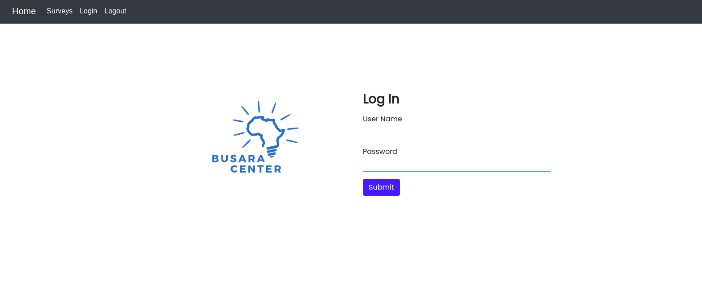

# Busara
####  **Odero Oluoch**

## Description
This is a web based App based on a technical test by the Busara hiring team. The App allows a user to log in, view logged-in users, and fill a survey. The App loads data from an API that uses OAuth. All proceeding HTTP requests are protected and require auth token. 

## Technologies used
- Angular CLI
- TypeScript
- Bootstrap CSS
- HTML

## Bugs being worked on
- It is under review the the hiring team

This project was generated with [Angular CLI](https://github.com/angular/angular-cli) version 11.2.12.

## Installation
Assuming you have Angular CLI installed, clone this project and navigate to the project folder. Run `yarn install` to download the required dependencies.

Run `ng serve` for a dev server. Navigate to `http://localhost:4200/`. The app will automatically reload if you change any of the source files. Alternatively, you can run `ng serve --open` or the shorthand `ng s -o` and the server will automatically open the app on the browser.

## Build

Run `ng build` to build the project. The build artifacts will be stored in the `dist/` directory. Use the `--prod` flag for a production build.

## Further help

To get more help on the Angular CLI use `ng help` or go check out the [Angular CLI Overview and Command Reference](https://angular.io/cli) page.

## Support and contact details
For comments an critics, reach out to [email](mailto:oderoluoch@gmail.com).
### LICENSE

Copyright &copy; 2021 **[Odero Oluoch](www.github.com/OderoOluoch)**

